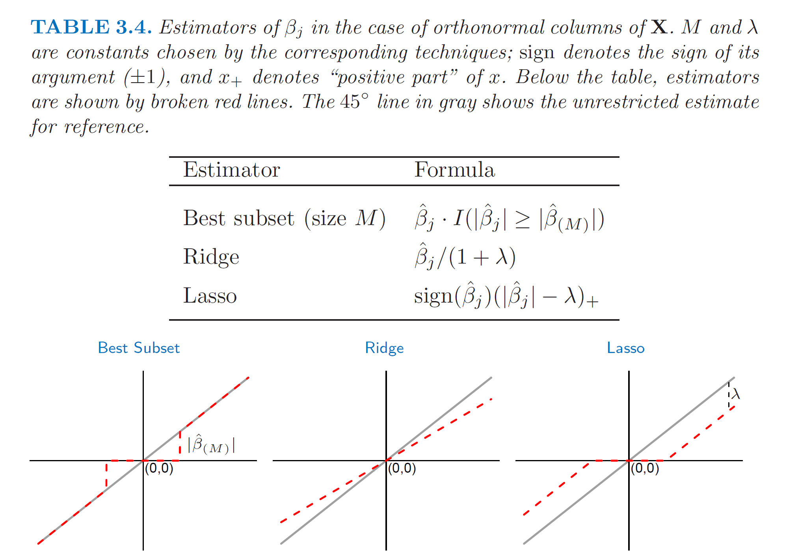
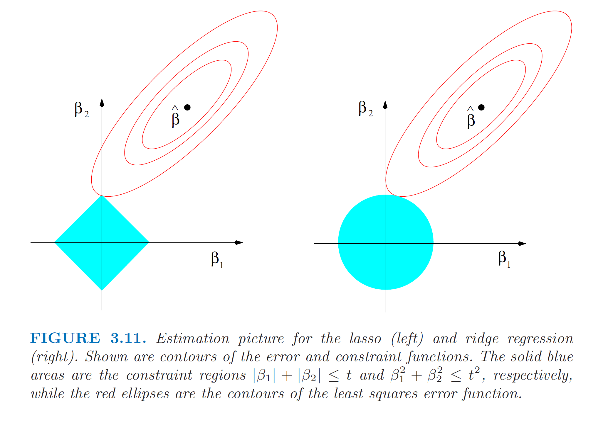

```{r setup, include=FALSE}
knitr::opts_chunk$set(echo = TRUE,warning=F,message=F)
```

## Motivation: 

- Prediction Accuracy: sacrifice bias to reduce the variance 
- Interpretation: smaller subset that exhibits the strongest effects. 

### Bias-Variance Tradeoff
If we assumet that $Y = f(X) + \epsilon$ where $E(\epsilon) = 0$ and $Var(\epsilon) = \sigma_{\epsilon}^2$. The expected prediction error of a regression fit $\hat{f}(X)$ at an input point $X = x_0$ is 

$$
\begin{align*}
Err(x_0) &= E[(Y - \hat{f}(x_0))^2 | X = x_0] \\
&= E[(Y - f(x_0) + f(x_0) -\hat{f}(x_0))^2 | X = x_0] \\
&= \sigma_{\epsilon}^2 + [E \hat{f}(x_0) - f(x_0)]^2 + E[\hat{f}(x_0)- E\hat{f}(x_0)]^2 \\
&= \text{Irreducible Error} + \text{Bias}^2 + \text{Variance}
\end{align*}
$$

 - First term: the variance of the target around its true mean $f(x_0)$, cannot be avoided
 - Second term: squared bias, the average of our estimate differs from the true mean
 - Last term: variance, the expected squared deviation of $\hat{f}(x_0)$ around its mean
 
Typically, the more complex we make the model $\hat{f}$ , the lower the bias but the higher the variance.


## Subset selection

### Best-subset selection

- search through all possible subsets: for each $k \in \{0,1,...,p \}$ find the subset among $\binom{p}{k}$ models that gives smallest residual sum of squares. $O(2^p)$

- an efficient algorithm- the leaps and bounds
is feasible for p as large as 30 or 40. 

- computational and statistical problems: cannot deal with large $p$.Large search space could lead to overfitting.

#### R Implementation

- `regsubsets` function from `leaps` package | [documentation](https://www.rdocumentation.org/packages/leaps/versions/2.1-1/topics/regsubsets)
    - nbest: number of subsets of each size to record
    - nvmax: maximum size of subsets to examine
- built-in `plot` function to display the selected variables in each model, ordered by the model selection criterion, e.g. $C_p$, AIC, BIC, Adjusted $R^2$. 

```{r}
#library(ISLR)
library(leaps)
library(glmnet)
data("mtcars")
reg.full = regsubsets(mpg~., data = mtcars,nvmax = 10)
summary(reg.full)
plot(reg.full, scale = "bic")
```


### Forward and backward stepwise selection

- seek a good path: a __greedy algorithm__ to produce a nested sequence of models. $O(p^2)$

- computational and statistical advantages

- optimal criteria: $C_p$, AIC, BIC, Adjusted $R^2$, cross-validation

#### R Implementation
- `regsubsets` function, `method = c("forward","backward")` 

- `stepAIC` function from `MASS` package | [documentation](https://www.rdocumentation.org/packages/MASS/versions/7.3-51.5/topics/stepAIC)

```{r}
reg.fwd = regsubsets(mpg~., data = mtcars,nvmax = 10,method = "forward")
summary(reg.fwd)

reg.bwd = regsubsets(mpg~., data = mtcars,nvmax = 10,method = "backward")
summary(reg.bwd)
```

## Optimal Model 
- RSS reflects __training error__, the full model(containing all the predictors) will have the smallest RSS and largest $R^2$
- We want to choose a model with low __test error__

#### Mallow Cp and AIC 

For the Gaussian model containing $d$ predictors,

$$
\begin{align*}
C_p &= \frac{1}{n}(RSS + 2d \hat{\sigma}^2) \\
AIC &= \frac{1}{n \hat{\sigma}^2}(RSS + 2d \hat{\sigma}^2)
\end{align*}
$$

- $C_p$ and AIC are proportional to each ohter in least squares models.

- $C_p$ adds a penalty to the training RSS to adjust for the fact that the training error tends to underestimate the test error. 

- The model with the lowest $C_p$ value is the _best_. 


#### BIC

$$
BIC = \frac{1}{n \hat{\sigma}^2}(RSS + log(n) d \hat{\sigma}^2)
$$

- Derived from Bayesian point of view
- The model with the lowest BIC value is the _best_. 
- Compared with $C_p$, BIC places a heavier penalty when the number of variables increases. 

#### Adjusted R^2

$$
\text{Adjusted} \ R^2 = 1- \frac{RSS/ (n-d-1)}{TSS/(n-1)}
$$

- $R^2 = 1- RSS/TSS$, the usual $R^2$ always increases as more variables are added to the model.
- Unlike the above statistics, a large value of  adjusted $R^2$ indicates low test error. 
- Intuition: once all of the correct variables are included in the model, adding additional variables will lead to a small decrease in RSS; however, adding variables will lead to an increase in $d$, which lead to an increase in RSS/$(n-d-1)$.

## Sparsity: Shrinkage Methods

- Problem with subset selection: discrete process(either retain or discard), high variability, cannot reduce the prediction error.

- Alternative to subset selection: fit a model containing all $p$ predictors using a technique that constrains or regularizes the coefficient estimates. 


### Ridge regression


$$ \hat{\beta}  = argmin_{\beta} \sum_{i=1}^N (y_i - \beta_0 - \sum_{j=1}^p x_{ij} \beta_j)^2 + \lambda \sum_{j=1}^p \beta_j^2 $$

- improvement over least squares: bias-variance trade-off
- disadvantage: the penalty will shrink all of the coefficients toward zero, but not exactly zero

#### R Implementation

- `glmnet` and `cv.glmnet` function from `glmnet` package | [documentation](https://www.rdocumentation.org/packages/glmnet/versions/3.0-2/topics/glmnet) | [vignette](https://web.stanford.edu/~hastie/glmnet/glmnet_alpha.html)
    - `alpha` argument: `alpha= 0`: ridge regression, `alpha = 1`: lasso 

- built-in `plot` function: produce the coefficient paths for a glmnet model.
    - `xvar` argument: `norm`: plots against the L1-norm of the coef, `lambda`: against the log-lambda sequence
    - each curve represents the path of a variable's coefficient as $\lambda$ varies. The axis above indicates the number of nonzeor coefs at current $\lambda$. 
    
- `cv.glmnet`: cross-validation to determine the value of $\lambda$. 
    - `lambda.min`: the value of $\lambda$ that gives minimum mean cross-validation error.
    - `lambda.1se`: the largest value of $\lambda$ such that error is within 1 standard error of the minimum.

```{r}
library(glmnet)
x = model.matrix(mpg~.,data = mtcars)[,-1]
y = mtcars$mpg

grid = 10^seq(4,-2,length.out = 100)
ridge.fit = glmnet(x,y,alpha = 0, lambda = grid)
plot(ridge.fit, label = T)
plot(ridge.fit, xvar = "lambda",label = T)

ridge.fit = cv.glmnet(x,y,alpha = 0, lambda = grid)
plot(ridge.fit)
lambda_opt = ridge.fit$lambda.min
ridge.coef  = predict(ridge.fit, type = "coefficients", s = lambda_opt)[1:11,]
ridge.coef
```


### Lasso

$$ \hat{\beta}  = argmin_{\beta} \sum_{i=1}^N (y_i - \beta_0 - \sum_{j=1}^p x_{ij} \beta_j)^2 + \lambda \sum_{j=1}^p |\beta_j| $$
```{r}
lasso.fit = glmnet(x,y,alpha = 1, lambda = grid)
plot(lasso.fit)

lasso.fit = cv.glmnet(x,y,alpha = 1, lambda = grid)
plot(lasso.fit)
lambda_opt_lasso = lasso.fit$lambda.min
lasso.coef  = predict(lasso.fit, type = "coefficients", s = lambda_opt_lasso)[1:11,]
lasso.coef
```


### Generalizations of Lasso Penalty: The Elastic Net and The Group Lasso

#### Elastic Net
Compromise between the ridge and the lasso penalties.

$$ \hat{\beta}  = argmin_{\beta} \ \frac{1}{2} \sum_{i=1}^N (y_i - \beta_0 - \sum_{j=1}^p x_{ij} \beta_j)^2 + \lambda [ \frac{1}{2} (1-\alpha)\| \beta \|_2^2 + \alpha \| \beta \|_1  ]$$
When $\alpha=1$, it reduces to $\mathcal{l}_1$ norm; and when $\alpha = 0$, it reduces to squared $\mathcal{l}_2$ norm. 

#### Group Lasso
Natural group structure: have all coefficients within a group become nonzero (or zero) simultaneously. 

$$ \hat{\theta}  = argmin_{\theta} \ \frac{1}{2} \sum_{i=1}^N (y_i - \theta_0 - \sum_{j=1}^J z_{ij} \theta_j)^2 + \lambda \sum_{j=1}^J \| \theta_j \|_2$$

where $\|\theta_j \|_2$ is the Euclidean norm of the vector $\theta_j$. 

## Comparison

### Special case: explicit solutions of estimators


- The ridge regression coef estimates are shrunken proportionally towards zero

- The lasso coef estimates are soft-thresholding, shrinks each coef by a constant factor $\lambda$ and samll coefs are shrunken to zero

- best-subset: hard-thresholding


### Contours and constraint regions



- Elliptical contours of residual sum of squares, centered at the full least squares estimate. The RSS increases as the ellipse expand away, and the estimates are given by the first point where an ellipse contacts the constraint region.


## Reference

- [ISLR]  James, G., Witten, D., Hastie, T., & Tibshirani, R. (2013). An introduction to statistical learning (Vol. 112, pp. 3-7). New York: springer.
- [ESL] Friedman, J., Hastie, T., & Tibshirani, R. (2001). The elements of statistical learning (Vol. 1, No. 10). New York: Springer series in statistics.
- [SLS] Hastie, T., Tibshirani, R., & Wainwright, M. (2015). Statistical learning with sparsity: the lasso and generalizations. Chapman and Hall/CRC.

- [glmnet vignette] Hastie, T., & Qian, J. (2014). Glmnet vignette. Retrieve from http://www.web.stanford.edu/~hastie/Papers/Glmnet_Vignette.pdf. Accessed September, 20, 2016.
